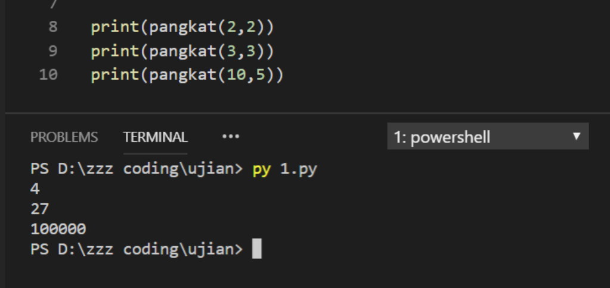

# Soal Ujian Python Data Science Fundamental


#

### **Soal 1 - Fungsi Pangkat**

Buatlah __sebuah return function__ dengan __2 parameter__ yang dapat menghitung pangkat tertentu dari sebuah bilangan, __tanpa__ menggunakan operator __pangkat ( ** )__ , tanpa menggunakan fungsi __pow( )__ dan tanpa memanfaatkan __package/library manapun!__

- __Case Flow__: Saat dieksekusi, program akan mencetak nilai return function.

    ```python
    print(pangkat(2, 2))
    print(pangkat(3, 3))
    print(pangkat(10, 5))
    ```

- Output yang diharapkan saat file diekseskusi via terminal:
  
    ```bash
    4
    27
    100000
    ```

- Contoh screenshot:

    

_**Catatan:**_ 

✅ Buatlah sebuah return function dengan 2 parameter: __pangkat(x, y)__

❌ Dilarang menggunakan operator pangkat ( __**__ )

❌ Dilarang menggunakan fungsi pangkat __*pow( )*__

❌ Dilarang menggunakan package manapun seperti: __Math__, __Numpy__, __PyPi__, dll.

✅ _Commit & push source code jawaban soal ini ke __Github__ Anda, buatlah repo dengan nama __Ujian_Fungsi_Pangkat__, kemudian lampirkan __url link repo Github__ Anda via email ke lintang@purwadhika.com!_

#

### *__#HappyCoding__* :relaxed:

#### Lintang Wisesa :love_letter: _lintangwisesa@ymail.com_

[Facebook](https://www.facebook.com/lintangbagus) | 
[Twitter](https://twitter.com/Lintang_Wisesa) |
[Google+](https://plus.google.com/u/0/+LintangWisesa1) |
[Youtube](https://www.youtube.com/user/lintangbagus) | 
:octocat: [GitHub](https://github.com/LintangWisesa) |
[Hackster](https://www.hackster.io/lintangwisesa)